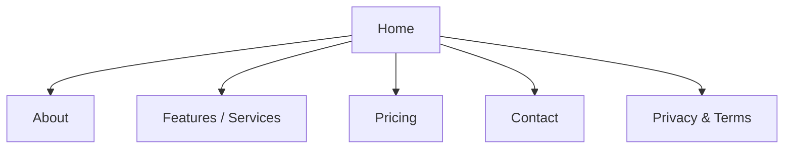
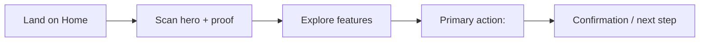

# Sitemap & Flows — <Client Name>

Source: prd.md (structure & pages). Every page here has a matching entry in
section-briefs.md and a wireframe under design/wireframes/.

## Sitemap

## Primary user flow

The path from landing to the primary desired action.

## Notes

- <Secondary flows, conditional paths, or navigation rules the designer should know.>
