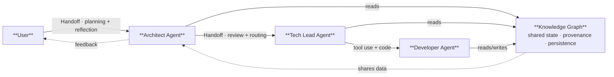

> **In here:** HumanEval 95.1% vs 67.0% · Loop/chain/network/graph as externalized cognition · Why the graphs-vs-loops debate matters now

# Graph Engineering for Multi-Agentic Systems: The Andrew Ng Playbook

Full Course From Scratch · 2026 Working Note on Agentic AI Practice

Based on Andrew Ng's courses, presentations, and the DeepLearning.AI curriculum.
Including the July 2026 Agentic Knowledge Graphs course (DeepLearning.AI + Neo4j + Google ADK).

Independently compiled, July 2026 — not affiliated with or endorsed by Andrew Ng or DeepLearning.AI.

## Fig. 1 — Graph-grounded multi-agent architecture

Fig. 1. Graph-grounded multi-agent architecture. The User delegates to an Architect Agent, which hands off to a Tech Lead and Developer Agent through typed handoffs. All agents read from and write to a shared Knowledge Graph. In-loop feedback flows back to the User at each stage.

## Abstract

Andrew Ng proved that GPT-3.5 wrapped in an agentic workflow scores 95.1% on HumanEval, outperforming GPT-4 at 67.0% in zero-shot mode. The architecture matters more than the model. Ng identifies four design patterns — Reflection, Tool Use, Planning, and Multi-Agent Collaboration. Anthropic independently formalized five production workflows. This note presents all nine patterns with implementation guidance, maps how they compose from simple loops into graph architectures, and provides a staged build path from day one to production. In July 2026, Ng released a course on building agentic knowledge graphs from scratch, positioning graphs as the natural evolution beyond loops for systems that need persistent state, cross-session reasoning, and multi-agent coordination. The central thesis: a loop externalizes revision, a chain externalizes task order, a network externalizes role specialization, and a graph externalizes shared state and relationships. Once multiple workers must preserve facts across sessions, coordinate without copying transcripts, and explain why a result changed, the system needs a durable information layer.

*Index Terms* — Agentic AI, design patterns, reflection, tool use, planning, multi-agent collaboration, workflow orchestration, graph architecture, knowledge graphs, LLM agents.

## I. Introduction

Asking an LLM to generate a useful output in one pass is difficult for the same reason that writing a polished essay in one uninterrupted pass is difficult. Ng's analogy is deliberately ordinary: a human writer drafts, reads, deletes, checks sources, reorganizes paragraphs, and asks other people for criticism. A zero-shot LLM is usually denied all of those opportunities. Despite that constraint, modern models perform remarkably well. The central claim of agentic design is not that direct prompting is useless. The claim is that many tasks become substantially more reliable when the model is placed inside a workflow that permits iteration, evidence gathering, decomposition, and role separation.

The HumanEval example makes the architecture argument concrete. As reported by Ng, GPT-3.5 used zero-shot solves 48.1% of the benchmark, while GPT-4 used zero-shot solves 67.0%. When GPT-3.5 is wrapped in an agentic workflow, the reported score rises to 95.1%. The improvement from GPT-3.5 to GPT-4 is therefore dwarfed by the improvement associated with iterative workflow design. Ng summarizes: "AI agentic workflows will drive massive AI progress this year — perhaps even more than the next generation of foundation models." The statement shifts attention from model selection to system design.

Ng's four patterns provide the initial vocabulary. Reflection lets a model inspect and revise its work. Tool Use lets it obtain information outside its parameters. Planning lets it select steps. Multi-Agent Collaboration lets multiple instances contribute distinct capabilities. The key synthesis of this note is that these patterns are not isolated recipes. They are stages in the externalization of cognition. A loop externalizes revision. A chain externalizes task order. A network externalizes role specialization. A graph externalizes shared state and relationships.

### A. Why "Graphs vs. Loops" Matters Now

In July 2026, the agentic AI community is actively debating the next layer beyond loops. Peter Steinberger's post — "Are we still talking loops, or did we shift to graphs yet?" — drew over 2.7 million views. Within the same week, Ng released a free course on building agentic knowledge graphs from scratch (DeepLearning.AI, taught by Neo4j's Andreas Kollegger), covering graph construction, multi-agent system architecture on graphs, and practical demonstrations using Google's Agent Development Kit (ADK). The course positions graphs as the foundational infrastructure for agents that need to persist facts, share state, and reason across sessions.

The decision tree is simpler than the debate makes it sound. A single well-scoped task, retryable, with human review of output — a loop is correct. Multiple specialized agents, branching logic, state that must persist across sessions — graph-based orchestration. The two are not competing paradigms; they are successive stages in the externalization of cognition, and most production systems will use both.

### B. Contributions

This synthesis makes three contributions. First, it presents Ng's four design patterns and Anthropic's five workflow patterns in one implementation-oriented account. Second, it maps how the patterns compose into loop, chain, network, and graph architectures. Third, it offers a decision framework and a staged build path that treats evaluation, cost, latency, and debuggability as first-class constraints.
