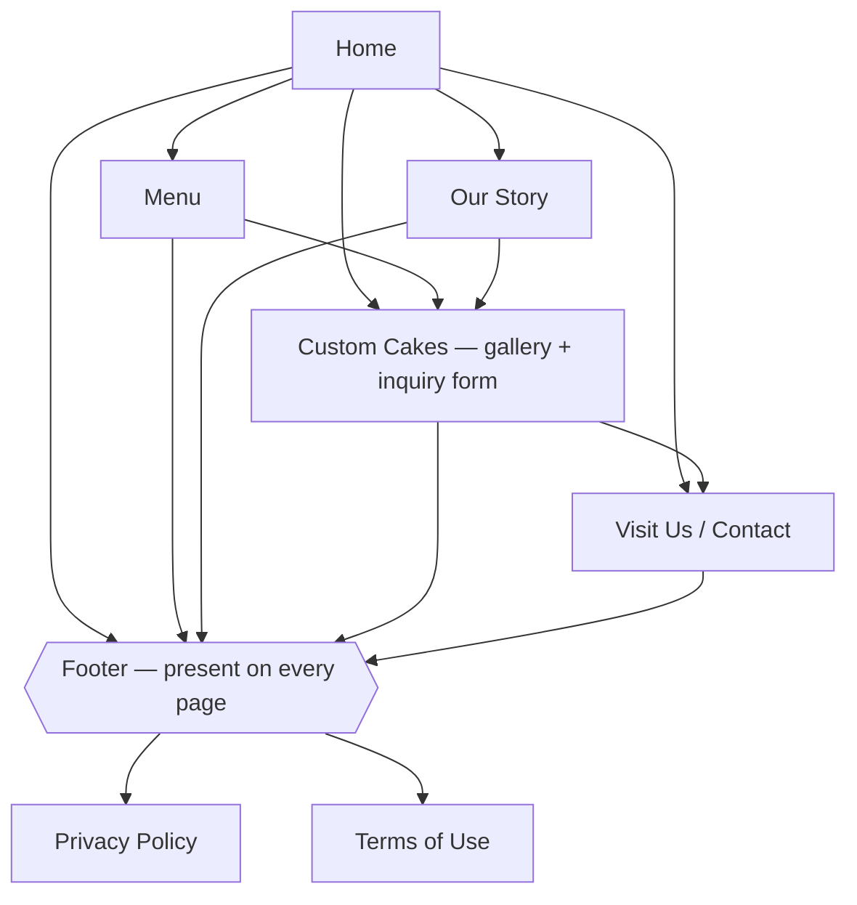
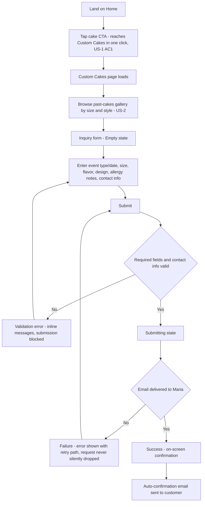
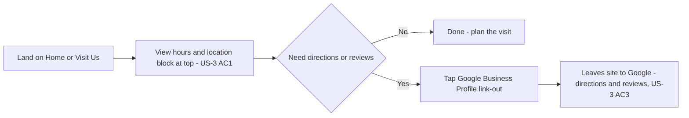
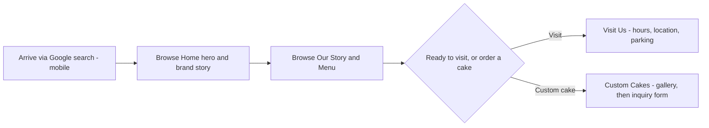

# Sitemap & Flows — Bluebird Bakery

Source: prd/prd.md (§4 Scope & non-goals, §6 Functional requirements). Every page here has a
matching entry in section-briefs.md and a wireframe under design/wireframes/ (legal pages are
covered in section-briefs.md; they have no dedicated wireframe this wave — see Notes).

## Sitemap

## Primary user flows

### Flow 1 — Cake inquiry (primary action, US-1 + US-2)

The site's one job: get a cake customer from landing to a submitted, acknowledged inquiry.
Covers the empty, validation-error, submitting, success, and failure states from PRD §6.

### Flow 2 — Hours check (regular, US-3)

The secondary-but-frequent path: a regular confirming hours/location, then optionally
leaving the site for directions or reviews.

### Flow 3 — New-visitor orientation (US-4)

A supporting flow: someone who found Bluebird via Google search deciding whether to visit,
before either the hours path or the cake-inquiry path.

## Notes

- **Nav is a full mesh, not a tree.** The sitemap diagram shows site hierarchy for
  readability; in practice the primary nav (in the shared header) exposes all five pages
  from every page, and the Custom Cakes CTA is reachable from Home in one click per PRD §6.
- **Footer is shared.** Every page renders the same footer with legal links (Privacy,
  Terms), secondary nav, and contact — modeled once as a shared `Footer` node above rather
  than repeated per page.
- **Gallery is folded into Custom Cakes, not a separate page** — the client's leaning
  answer to the PRD's open question (§10); the sitemap reflects that resolution.
- **Validation error and failure are both loop-backs, not dead ends.** Validation error
  returns the customer to the same filled-in form (inline errors); failure returns to the
  Submit action itself (retry), per PRD §6 form states — neither silently drops the
  request.
- **Allergy/dietary notes** entered in the Flow 1 form are sensitive: captured, then routed
  only to Maria's inbox — never displayed on-screen back to the customer beyond the generic
  success confirmation, and never stored elsewhere (PRD §6, §8).
- **Google Business Profile is link-out only** — no embedded map, no site-side directions
  logic. Flow 2 treats leaving the site as the intended end state, not a failure.
- Legal pages (Privacy, Terms) are static and reached only via the footer; no dedicated user
  flow is drawn for them.
